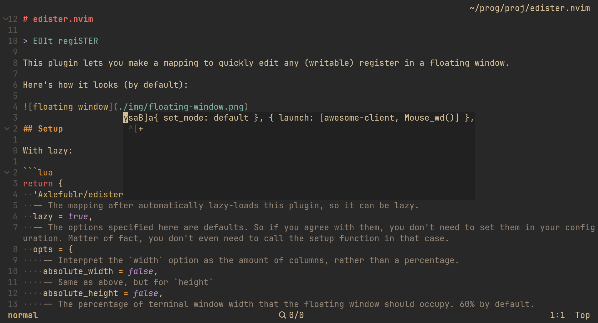

# edister.nvim

> EDIt regiSTER

This plugin lets you make a mapping to quickly edit any (writable) register in a floating window.

Here's how it looks (by default):



## Setup

With lazy:

```lua
return {
  'Axlefublr/edister.nvim',
  -- The mapping after automatically lazy-loads this plugin, so it can be lazy.
  lazy = true,
  -- The options specified here are defaults. So if you agree with them, you don't need to set them in your configuration. Matter of fact, you don't even need to call the setup function in that case.
  opts = {
    -- Interpret the `width` option as the amount of columns, rather than a percentage.
    absolute_width = false,
    -- Same as above, but for `height`
    absolute_height = false,
    -- The percentage of terminal window width that the floating window should occupy. 60% by default.
    width = 0.6,
    -- Same as above, but for height. 30% by default.
    height = 0.3,
    -- If unset, center the floating window vertically. If set to a number, offset the window that many columns from the left side of your neovim window.
    columns = nil,
    -- Same as above, but *horizontally* instead, and from the top side of your neovim window. If you don't set `rows` and `columns`, the floating window is fully centered.
    rows = nil,
    -- Expects the same thing as the `border` option in `:h nvim_open_win()`. No borders by default.
    border = nil,
  }
}
```

And somewhere in your configuration, you should also add the mapping to use the plugin:

```lua
vim.keymap.set('n', '<Leader>g', function() require('edister').edit_register() end)
```

## Usage

The `edit_register` function can take two arguments.

### `register`

The first argument is the `register` that you want to edit.

However, if you don't specify that argument (or set it to `nil`), a register is going to be automatically asked from you, interactively.

So, the workflows ends up being something like this:

> "oh damn, I messed up that macro in the q register, gotta edit it now!"

Then you press `<Leader>g` and see an input prompt, asking you to enter a register. This input prompt just expects you to press a single character, and makes sure that what you enter is a valid, writable register.

So now you can just press `q` and you'll see the floating window! Edit the register however you like, then close the window. Your changes are saved! I have to warn you though, your changes are going to be saved even if you didn't _save_ and close, and instead just closed.

Valid (writable) registers are: `", +, *, #, =, _, /, 0-9, a-z, A-Z`. Uppercase registers aren't different from lowercase registers in this plugin, they're supported just so you could accidentally press shift and still use the plugin fine.

### `reg_type`

The second argument is the type of the register that you want it to be. Registers can be linewise, characterwise, blockwise. By default, the type of an edited register stays the same. So if you edit a linewise register, it stays linewise. Editing a characterwise register? Yep, will also stay characterwise.

But you can pass the `reg_type` argument to change some register's type to another one. `reg_type` accepts the same things as `:h setreg()` does, for specifying the register type.

If you set `reg_type` to the special variant "ask", then, after you close the floating window, you will be interactively asked for the register type that you want. Press a single character out of l (linewise) / c (characterwise) / b (blockwise), and the register will be turned into that type (keeping your edit).

If you pressed escape, your edit isn't saved at all. You get to have the option of the final "nevermind" here, unlike in default behavior. If the character you pressed isn't one of l / c / b, the previous register type will be kept, and your edit _will_ be saved.

Suggested mapping:

```lua
vim.keymap.set('n', '<Leader>G', function() require('edister').edit_register(nil, 'ask') end)
```

It also may be viable to have this as your default mapping, if you're okay with having to press an additional key every time you want to edit a register.
